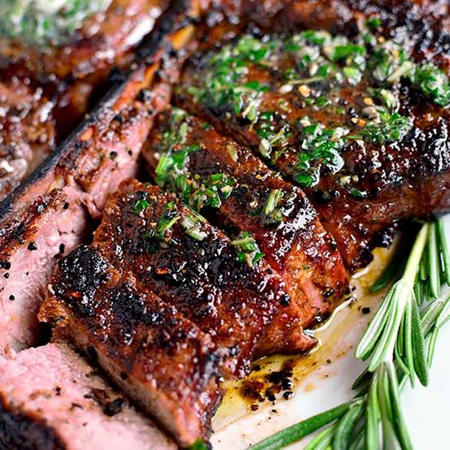
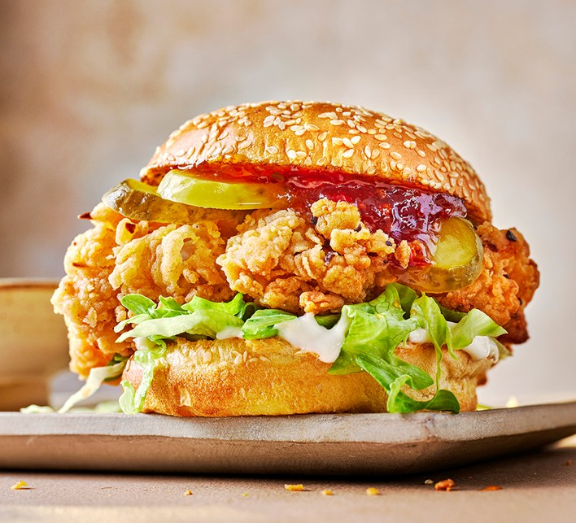
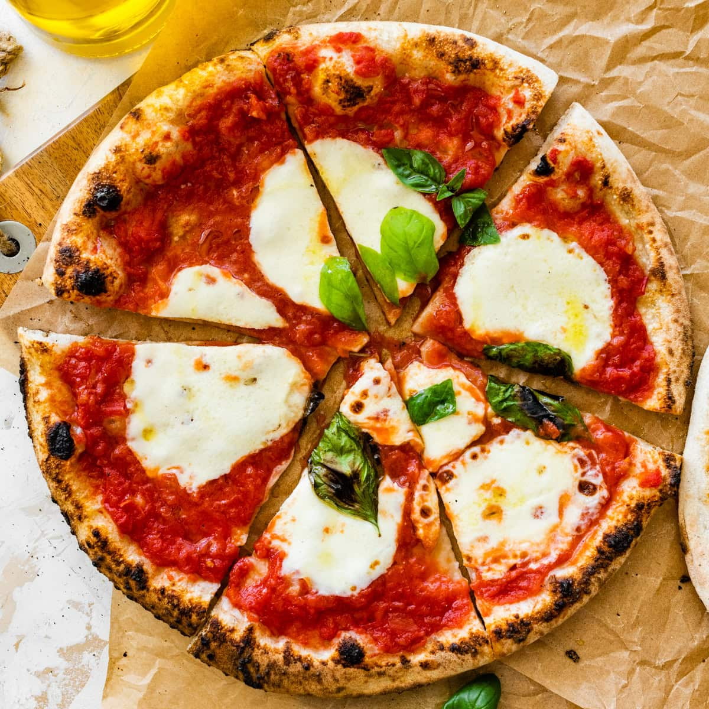
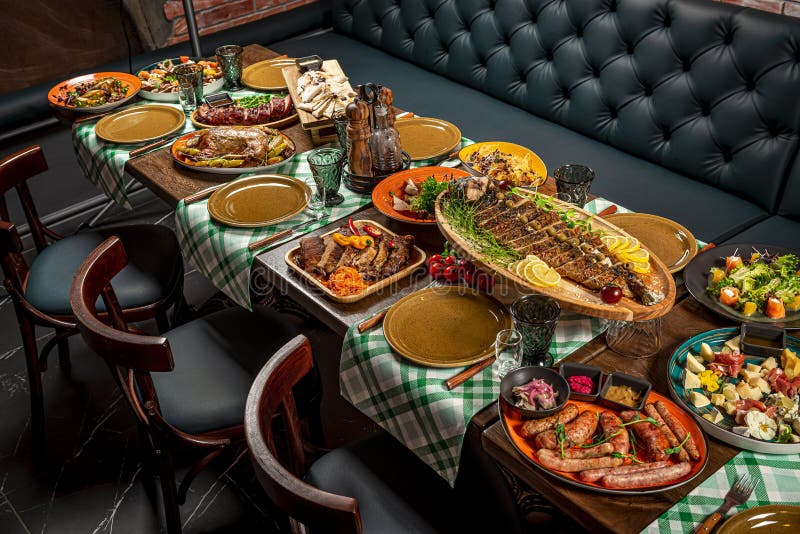

<!DOCTYPE html>
<html lang="en">
<head>
<meta charset="UTF-8">
<meta name="viewport" content="width=device-width, initial-scale=1.0">
<title>Delicious Restaurant</title>
<link href="https://fonts.googleapis.com/css2?family=Roboto:wght@400;700&display=swap" rel="stylesheet">

</head>

<body>

<header>
  

    <h1 class="logo">Delicious</h1>
    <input type="checkbox" id="menu-toggle">
    <label for="menu-toggle" class="hamburger">
      
    </label>
    <nav>
      <a href="#home">Home</a>
      <a href="#about">About</a>
      <a href="#menu">Menu</a>
      <a href="#contact">Contact</a>
    </nav>
  

</header>

<section class="hero" id="home">
  

    <h2>Fresh & Delicious Food</h2>
    
Experience the best taste from our chefs

    <button>View Menu</button>
  

</section>

<section class="about container" id="about">
  <h2>About Our Restaurant</h2>
  
We serve high quality food made from fresh ingredients. Our chefs create amazing dishes that bring happiness to every customer.

</section>

<section class="menu container" id="menu">
  <h2>Popular Dishes</h2>
  

    
<h3>Grilled Steak</h3>
$18

    
<h3>Chicken Burger</h3>
$10

    
<h3>Italian Pizza</h3>
$14

  

</section>

<section class="gallery container" id="gallery">
  <h2>Food Gallery</h2>
  

    
    
    
    
  

</section>

<section class="reservation" id="reservation">
  <h2>Reserve a Table</h2>
  <form class="reservation-form">
    <input type="text" placeholder="Your Name">
    <input type="email" placeholder="Email">
    <input type="date">
    <input type="number" placeholder="Guests">
    <button>Book Table</button>
  </form>
</section>

<section class="reviews container">
  <h2>Customer Reviews</h2>
  

    

"Amazing food and great service!"
<h4>- John</h4>

    

"Best pizza I have ever tasted."
<h4>- Sarah</h4>

    

"Beautiful atmosphere and delicious meals."
<h4>- David</h4>

  

</section>

<section class="contact" id="contact">
  <h2>Contact Us</h2>
  
Email: restaurant@email.com

  
Phone: +123 456 789

</section>

<footer>
  
© 2026 Delicious Restaurant

</footer>

</body>
</html>
